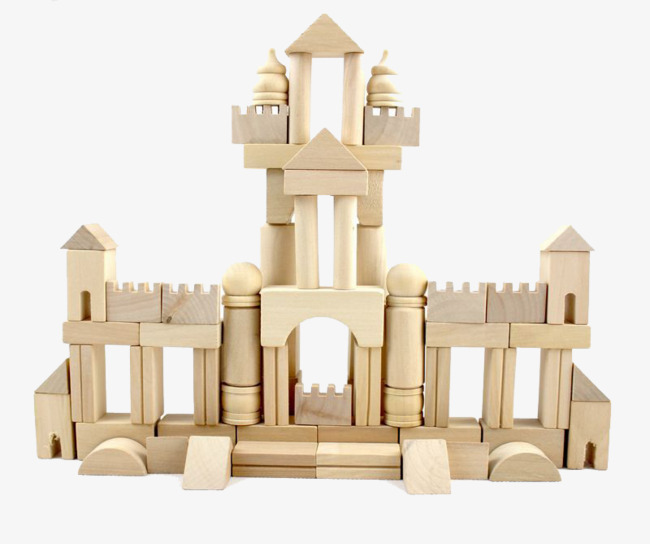

# How to Deal with Components in V.A.R?

Component is an important concept of modern front-end frameworks. It means the minimum HTML elements of representing a complete unit of UI. Therefore, you can organize and reuse components to construct the complex UI.

